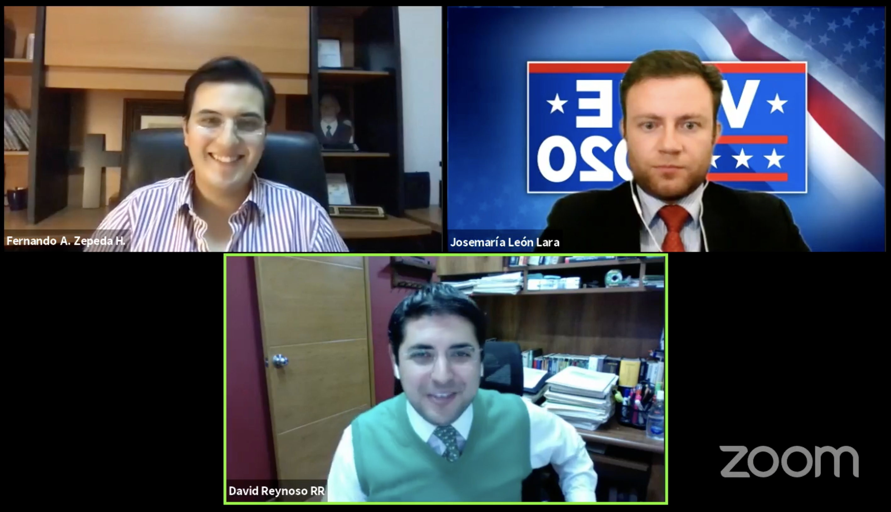

```{r setup, include=FALSE}
knitr::opts_chunk$set(echo = TRUE)
```

Tuve la oportunidad de colaborar con El Búnker Político de Aguascalientes y platicar con David Reynoso y Josemaría León Lara sobre los resultados electorales en Estados Unidos la noche de la jornada electoral. Pueden volver a consultar la mesa redonda aquí:

[](https://www.facebook.com/903141280075341/videos/415146656151550)
